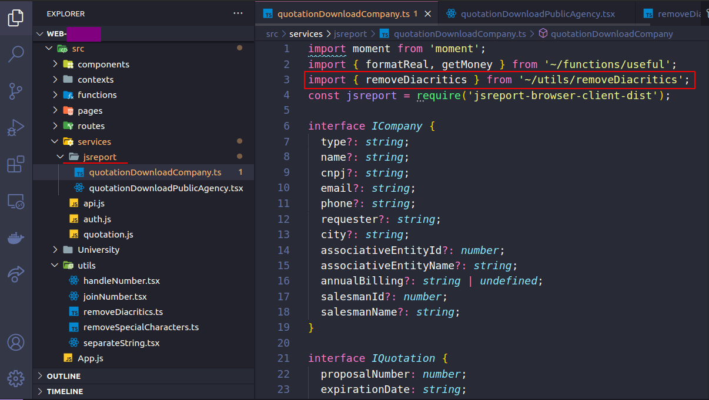
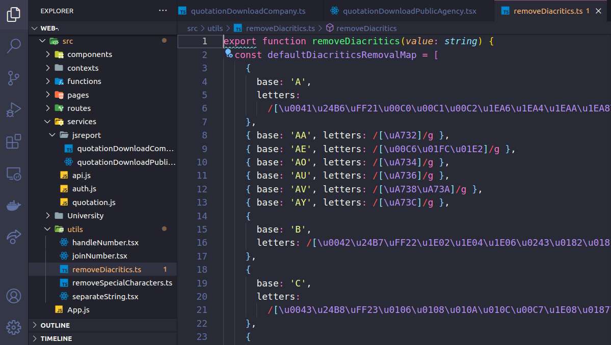

# alterar-nomenclatura-de-orcamentos-PDF
Funcionalidade da alteração nomenclatura do orçamentos em PDF

## No Arquivo: -> quotationDownloadCompany.ts
Que ficara para organização na pasta: /jsreport
Precisa importa a função que estara na pasta utils
Ex: 
import { removeDiacritics } from '~/utils/removeDiacritics'.

<h1 align="center">
    
</h1>

- Imag 01
 

### E o Codigo para busca a função ficara assim como segue abaixo:
<h1 align="center">
    
</h1>

OBS: - nome01 = nome da empresa que esta fornecendo o orçamento.
- Imag 02
 

## No Arquivo: -> removeDiacritics.ts
Que ficara para organização na pasta: /utils
Usar o codigo que esta disponivel Aquivo: removeDiacritics.ts
<h1 align="center">
    
</h1>

E um codigo grande, mais ira deixa tudo bem organizado para altera o arquivo PDF.

- Imag 04
